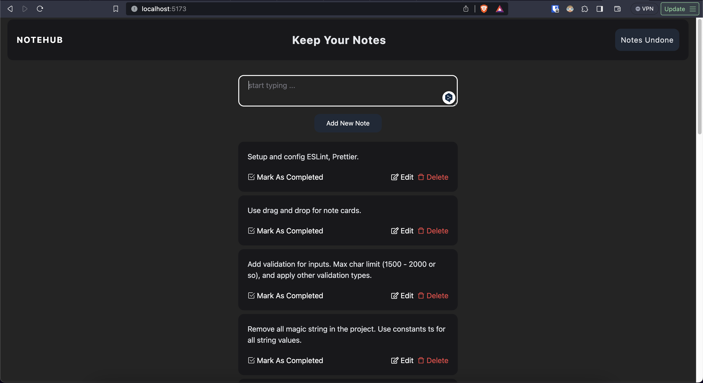
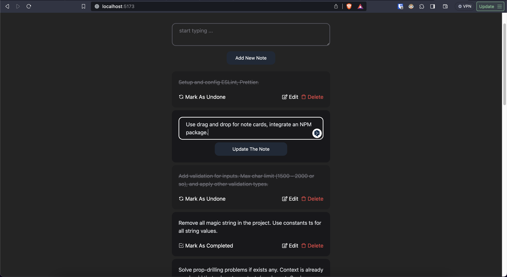

# Notehub - Keep And Organize Your Notes

### Contents

This lightweight application, `Notehub`, is designed to simplify your notekeeping experience, allowing you to add, update, and delete notes with ease.

> **Notehub**: Welcome to `Notehub` – your go-to solution for straightforward note management issues.

- [About The Project](#project)
- [Tech Stack](#tech-stack)
- [Usage](#usage)
- [Future Improvements](#dev)

### About The Project <a name="project"></a>

- With `Notehub`, you have the power to effortlessly create, update, and delete notes at your fingertips. Whether you're a planner or someone who just loves staying organized, `Notehub` is designed for you.

- Think of it like a personal notebook that you can take anywhere, without the risk of losing a page.

- Finally, Whether you're a developer looking for an easy-to-use task tracker or a student organizing lecture notes, `Notehub` adapts to your needs.





### Tech Stack <a name="tech-stack"></a>

##### Technologies used for Notehub:

- React
- TypeScript
- Context API
- Tailwind CSS

### Usage <a name="usage"></a>

Clone the repository.

```bash
git clone https://github.com/berkesayin/northwind-store.git
```

Install the dependencies.

```bash
npm install
```

Locate the root directory at terminal, and start the project.

```bash
npm run dev
```

Navigate to [http://localhost:5173](http://localhost:5173) and take your notes :)

### Future Improvements <a name="dev"></a>

> **Note**: The project is still under development. The features listed below will be developed and integrated to the `Notehub` application.

##### Features

- Drag and drop structure for note cards.
- Additional column for completed notes. When a note is created, it will be added the `undone tasks` column first, once it is done, it will be moved to `completed tasks` column.
- Easiliy integration to other projects that would need to use the features which `NoteHub` offers.
- Validation for TextArea component.
- More functionalities for TextArea component including italic, bold, unordered list, list features.
- Live Demo.
- Functional responsive design, all issues solved.
- Nice hover effect for note cards.
- Badges for note cards to categorize notes.
